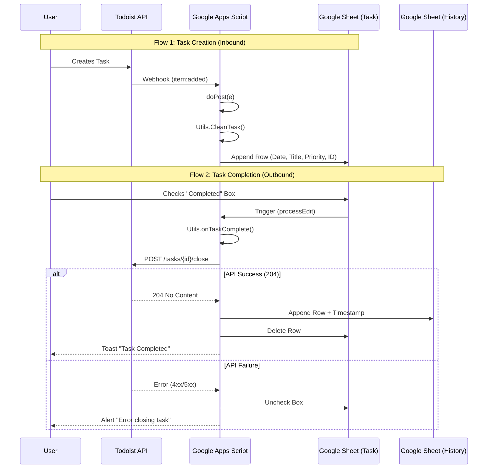

# Project Architecture

This document outlines the architectural design and data flow of the Tasks Tracker project. The system acts as a bridge between the Todoist API and Google Sheets, utilizing Google Apps Script as the middleware.

## 🏗️ System Overview

The system operates on an event-driven architecture:

1.  **Inbound Flow (Todoist -> Sheet)**: Triggered by Webhooks when a task is created.
2.  **Outbound Flow (Sheet -> Todoist)**: Triggered by User Interaction (Edit) when a task is completed.

## 🧩 Modules Description

### 1. Configuration Layer (`Config.js`)

- **Responsibility**: Holds static constants.
- **Key Data**: Sheet names ("Task", "Completed Tasks"), UI Colors, and global settings.
- **Benefit**: Allows changing sheet names or branding colors in one place without breaking the logic.

### 2. Presentation Layer (`Setup.js`)

- **Responsibility**: Generates the User Interface in Google Sheets.
- **Functions**: `setupSheets()`.
- **Actions**:
  - Creates Sheets if they don't exist.
  - Applies formatting (Borders, Fonts, Colors).
  - Sets up Data Validation (Dropdowns).
  - Configures Frozen rows and hidden ID columns.

### 3. Logic & Data Layer (`Utils.js`)

- **Responsibility**: Handles data transformation and external API communication.
- **Key Functions**:
  - `CleanTask(task)`: Normalizes raw JSON from Todoist into a flat structure for the Sheet.
  - `closeTaskAPI(taskId)`: Sends a `POST` request to Todoist REST API v2 to close a task.
  - `onTaskComplete(e)`: Orchestrates the completion flow (Validate -> Call API -> Move Row).

### 4. Controller Layer (`Code.js`)

- **Responsibility**: Entry point for external events.
- **Key Functions**:
  - `doPost(e)`: Receives the Webhook payload, parses it, and delegates writing to the Sheet.
  - `processEdit(e)`: The bound function for the Installable Trigger that delegates to `Utils.onTaskComplete`.

## 🔄 Data Flow Diagram

The following diagram illustrates the lifecycle of a task within the system.

## 💾 Data Model

### Task Sheet Structure

| Col | Header      | Description                                   |
| :-- | :---------- | :-------------------------------------------- |
| A   | (Margin)    | Empty column for visual spacing               |
| B   | DATE        | Creation date formatted as `yyyy-MM-dd HH:mm` |
| C   | TASK        | Task content/title                            |
| D   | DESCRIPTION | Task description                              |
| E   | LINK        | URL to the task in Todoist                    |
| F   | PRIORITY    | Priority level (1-4)                          |
| G   | ASSIGNED_TO | Dropdown for user assignment                  |
| H   | COMPLETED   | Checkbox to trigger completion                |
| I   | ID_TODOIST  | **Hidden**. Stores the Task ID for API calls  |

### Completed Tasks Sheet Structure

Inherits all columns from **Task Sheet** and adds:
| Col | Header | Description |
| :--- | :--- | :--- |
| J | COMPLETED_AT | Timestamp of when the task was closed in Sheets |
